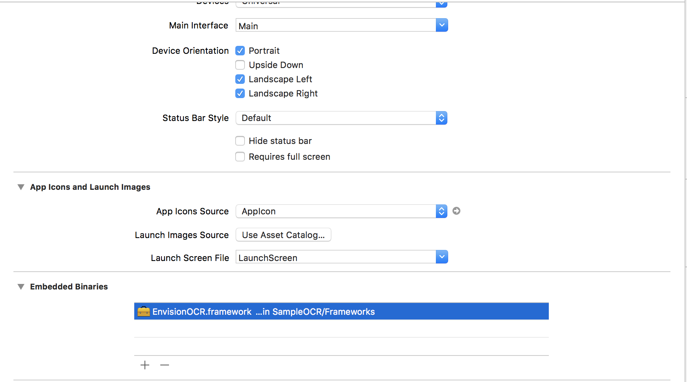

# Envision OCR  SDK Documentation

## Current OCR SDK version
Version: 1.1.4

Release Date: 16/07/2018

# Overview

Envision’s OCR SDK is the best in class OCR tool built specifically to help visually impaired users read texts around them. The models we use are optimised for detecting ‘Dense Text’ like the one found in books and magazines and ‘Scene Text’ like the text found on objects and displays. On the basis of these categories, the images are pre-processed to provide the optimal output in the shortest time with the greatest accuracy. 

Envision’s OCR SDK allows for two kinds of implementation:
* Instant Text:
This works by taking in a live video feed from a camera and providing the audio output for the detected text instantly. This is ideal for scanning through short pieces of text quickly.

* Document Text:
This works with a captured image and provides the output as segmented text blocks. This is ideal for reading long pieces of texts that need to be modified, exported and explored with VoiceOver.


With the OCR SDK you can have apps read all kinds of text such as train numbers, menu cards in a restaurant, etc. The SDK currently supports devices that run iOS 10 and above. You can use it with both Swift and Objective-C and all platforms that interop with them.

# How to get access?

If you are interested in using Enision's OCR SDK in your application(s), please contact us at karthik@letsenvision.com for a trial.

# iOS SDK Setup

1. The SDK is available as a framework that can be  installed by simply dragging and dropping the framework into the Xcode project. You will then need to go to your Project name → General → Click on the "+" in Embedded Binaries and select the EnvisionOCR.framework file from the dropdown. 



2. The framework also requires a small pod function effectively. You add 'SwiftyJSON' in your Podfile like seen below.

```
# Uncomment the next line to define a global platform for your project
# platform :ios, '9.0'

target 'envisionOCRTest' do
# Comment the next line if you're not using Swift and don't want to use dynamic frameworks
use_frameworks!
pod 'SwiftyJSON'
end
```

# Reading Text Instantly

Instant text recognition allows you to read short pieces of text in the real-world easily. It can be used to read signs in a train station,etc. The input can be provided both in terms of an image or a CMSampleBuffer object if you're running this on a live feed.

```
import EnvisionOCR

var envision = Envision()

override func viewDidLoad() {
super.viewDidLoad()
envision.instantText(image: image, apiKey: "API_KEY") 
{ (result) in
print("output text: \(results[0]["description"])")
print("output language: \(results[0]["language"])")
}
}
```
# Reading Document text

Document text recognition is meant for dense text such as text found in documents, books, etc. Envision can easily detect text in such items and easily return the language and segment the output into blocks, paragraphs, lines and words. 

The Document text function works both with images and CMSampleBuffer objects returned from a live camera stream. 

```
import EnvisionOCR

var envision = Envision()

override func viewDidLoad() {
super.viewDidLoad()
envision.documentText(image: image, apiKey: "API_KEY") 
{ (result) in
print("output text: \(results[0]["description"])")
print("output language: \(results[0]["language"])")
}
}
```

# Accessing the backend

The Envision OCR backend provides you with information on the current usage of your application and also allows you make request for new purchases. Currently, the usage data is updated every hour. 

You can access the dashboard by going to : https://www.letsenvision.com/dashboard/[company-name]

You will need a password to access this page and that would be provided by Envision when you sign up for the SDK service. 


# Technical Specifications

Compatible Operating Systems:
* iOS 10 and above

API available for:
* Objective-C
* Swift 3.0 and above. 

SDK Input:
* Image (JPEG, PNG, TIFF)
* Pixel buffers 

SDK Output:
* UTF-8 String

Disk Requirements:
* 5 MB iOS 10 and 8 MB for iOS 11.

RAM Requirements:
* 256 MB RAM
* 5 MB for the SDK to be copied from storage memory. 

Hardware Requirement
* ARMv7 processor, 600 MHz and higher


# Troubleshooting and Support

The SDK is robust enough to work across iPhone, iPad and currently supports iOS 10 and above. If you're currently running into issues with the service, you can write to us at support@letsenvision.com and we would be able to help you with it.
